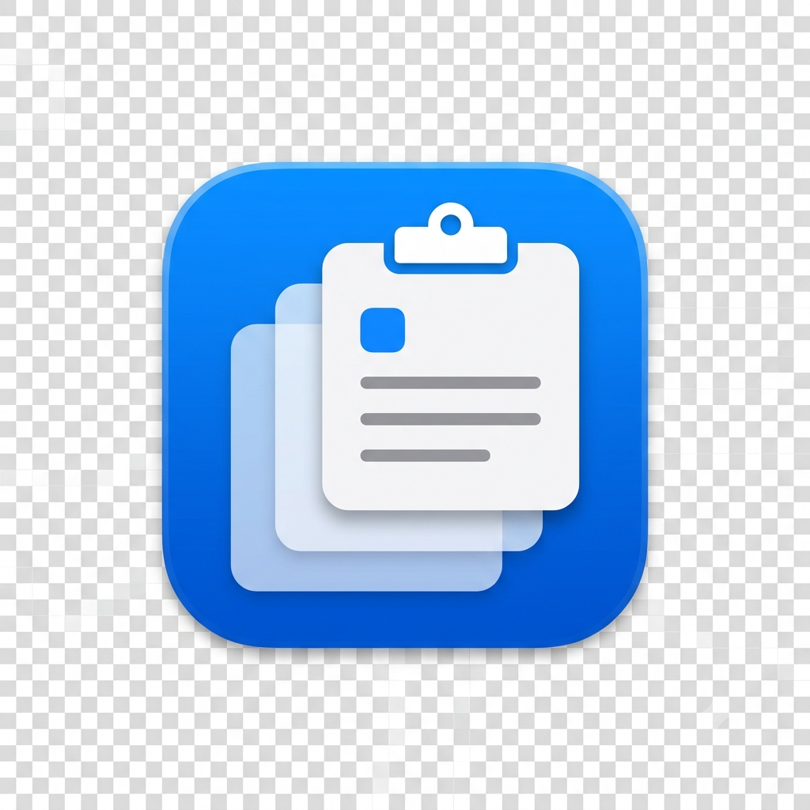
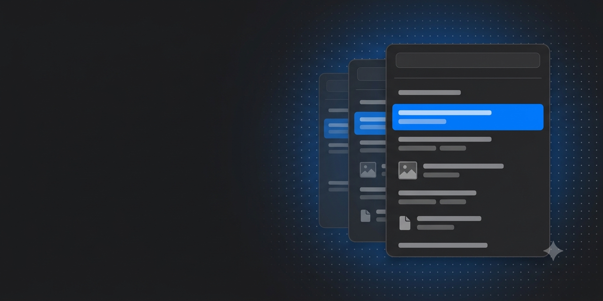

<div align="center">



# MacClipbrd

**Clipboard history manager for macOS — the Win+V equivalent.**


[](LICENSE)



</div>

---

## Features

- Records everything you copy — **text, images and files**. Last 200 entries,
  duplicates collapse to the top.
- Images show as a thumbnail with their pixel dimensions. Files show the system
  icon for their type, the file name and the size; a multi-file copy shows the
  file count and the combined size.
- Two ways to open: hotkey **⌥⌘V** (window at the cursor) or a click on the menu bar icon (window below the icon).
- Search — just start typing, the search field is already focused. Matches text
  entries and file names.
- Keyboard control: **↑ / ↓** to select, **Enter** to paste, **Esc** to close.
- Mouse: click an entry to paste it, hover for the trash icon to delete it.
- The selected entry is copied to the clipboard and pasted into the app you came
  from (simulated ⌘V), in its original form — an image pastes as an image, a file
  pastes as a file.
- **English and Russian**, switchable from the panel footer. English is the
  default; the choice persists and applies immediately.
- History survives restarts: `~/Library/Application Support/MacClipbrd/history.json`.
  Copied images are kept as separate files under `MacClipbrd/Images/` and are
  deleted when the entry drops out of the history, so the JSON stays small.

When several formats are on the clipboard at once, files win over images and
images win over text. Apps that copy both an image and its text representation
(Keynote, parts of Office) are therefore recorded as an image.

Requirements: **macOS 13+**, Apple Silicon or Intel.

---

## Install

1. Download `MacClipbrd.dmg`, open it, drag **MacClipbrd.app** into **Applications**.
   Install it in `/Applications` and leave it there: the Accessibility grant is
   tied to the app, and moving it elsewhere makes macOS ask for permission again.
2. Launch the app. No window appears — MacClipbrd lives in the menu bar, look for
   the clipboard icon in the top right.
3. On first launch it asks for **Accessibility**. Click "Open Settings" and
   enable the toggle next to MacClipbrd.
4. Copy something, press **⌥⌘V** — the history appears.

### If the app is not signed with a Developer ID

If you built the `.app` yourself (see "Building from source"), macOS shows
"MacClipbrd cannot be opened because the developer cannot be verified".
Workaround: right-click `MacClipbrd.app` → **Open** → **Open** in the dialog.
Once is enough.

---

## Permissions

MacClipbrd asks for exactly one system permission, and not for everything.

| Feature | Needs Accessibility |
|---|---|
| Recording clipboard history | no |
| ⌥⌘V hotkey | no |
| History window, search, arrow keys | no |
| Auto-paste into the active app (⌘V) | **yes** |

Without the permission the app is fully usable — the selected entry lands on the
clipboard and you press ⌘V yourself. The permission only lets MacClipbrd press
⌘V for you.

**Grant manually:** System Settings → Privacy & Security → Accessibility →
enable MacClipbrd (or "+" and pick `/Applications/MacClipbrd.app`).

MacClipbrd does **not** read your keystrokes and does **not** see the contents of
other apps' windows. Accessibility is used solely to post a single ⌘V event.

### Permission looks enabled but pasting does not work

The classic situation after an app update: the checkbox is ticked, but macOS
considers the app to be a different one. Reset it:

```
tccutil reset Accessibility com.macclipbrd.app
```

Then restart MacClipbrd and grant access again. If that does not help, remove
MacClipbrd from the list with "−", restart, and add it back.

---

## Building from source

```
./build-app.sh release      # → MacClipbrd.app
open MacClipbrd.app
```

For development: `swift build && swift run`. Command Line Tools are enough,
Xcode is not required.

### Stable signature for local builds

macOS ties a granted Accessibility permission to the app's code signature.
An ad-hoc signature (`codesign -s -`) changes on every rebuild, so the grant
would break after every `./build-app.sh`. To avoid that, create a local
certificate once:

```
./setup-cert.sh
```

The script creates a self-signed `MacClipbrd Dev` certificate in your keychain and
trusts it for code signing. `build-app.sh` picks it up automatically, and the
permission then survives rebuilds.

Use your own certificate with:
`SIGN_IDENTITY="Apple Development: you@example.com" ./build-app.sh`

---

## Distributing to users

To spare users both the "unidentified developer" dialog and permissions
breaking after every update, release builds must be signed with a Developer ID
and notarized. Ad-hoc and self-signed certificates are not suitable for
distribution: such builds break Accessibility for every user on every update.

Steps:

1. Sign with Developer ID, hardened runtime and a timestamp:
   ```
   codesign --force --options runtime --timestamp \
       --sign "Developer ID Application: Your Name (TEAMID)" MacClipbrd.app
   ```
   Do not use `--deep` — it is deprecated; sign nested code separately and the
   bundle last.
2. Package as `.dmg` (or `.zip`) and notarize:
   ```
   xcrun notarytool submit MacClipbrd.dmg --keychain-profile "notary" --wait
   xcrun stapler staple MacClipbrd.dmg
   ```
3. Ship the stapled `.dmg` — Gatekeeper lets it through silently.

What keeps permissions from breaking:

- `CFBundleIdentifier` (`com.macclipbrd.app`) stays the same across versions.
- The same Developer ID signs every release — TCC stores a requirement on the
  signature rather than a path, so updating in place preserves the grant.
- The user installs into `/Applications` and does not move the app.

`build-app.sh` prints the designated requirement of the bundle it built. Compare
it against the previous release — if the line changed, every user will lose
Accessibility on update:

```
codesign -d -r- MacClipbrd.app
```

Pre-granting Accessibility from an installer is impossible — the system forbids
it, the permission is always granted by a human. The one exception is
MDM-managed machines, where it is deployed via a PPPC profile with
`kTCCServiceAccessibility` and your Developer ID code requirement.

---

## Layout

- `main.swift` — entry point, `NSApplication` in accessory mode.
- `AppDelegate.swift` — menu bar item, panel presentation, pasting.
- `ClipboardMonitor.swift` — `NSPasteboard` polling (0.5 s), flavour selection.
- `HistoryStore.swift` — `ClipItem` model and persistence.
- `ImageStore.swift` — image files and thumbnails on disk.
- `HistoryView.swift` — SwiftUI interface, search and keyboard selection.
- `Localization.swift` — English/Russian string table.
- `CursorPanel.swift` — history window (at the cursor or below the menu bar icon).
- `HotKey.swift` — global hotkey via Carbon.

---

## License

MIT — see [LICENSE](LICENSE).
